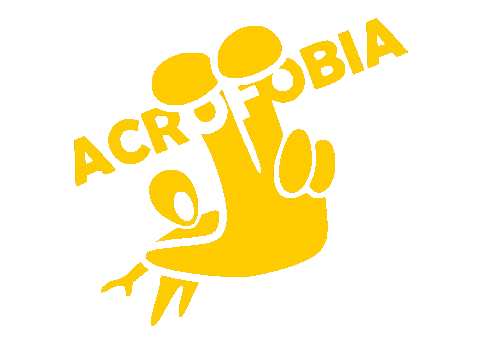

<div align="center">
  
  
  
  # AcroSystem
  
  **Sistema Integral de Gestión Deportiva y Acrobática para Acrofobia**
</div>

---

## 📖 Descripción del Sistema

**AcroSystem** es una plataforma completa diseñada específicamente para administrar y optimizar los procesos diarios de Acrofobia. El sistema permite controlar la base de datos de miembros, gestionar planes y suscripciones, registrar asistencias (check-in) con códigos QR, operar una tienda integrada (Punto de Venta/POS) y mantener un inventario al día, todo mientras se monitorean las finanzas en tiempo real.

## ✨ Características Principales

- 📊 **Dashboard y Métricas:** Resumen de ingresos diarios, asistencias semanales y proyecciones de clases.
- 👥 **Gestión de Miembros:** Registro de usuarios, perfiles detallados, historial de pagos y control de NDAR (Asunción de Riesgos).
- 🎟️ **Suscripciones y Check-in:** Control de planes (Pase Diario, Mensual, Niños, etc.) y lector de QR integrado para validar accesos rápidos.
- 🛒 **Punto de Venta (POS):** Carrito de compras, venta de productos físicos y planes, soportando métodos de pago multi-moneda (BCV, COP, Binance, Efectivo USD).
- 📦 **Inventario y Tienda:** Control de stock, creación de productos y alertas de inventario mínimo.

## 🛠️ Stack Tecnológico

AcroSystem está construido con tecnologías modernas y eficientes para garantizar velocidad, seguridad y una excelente experiencia de usuario:

- **[Next.js](https://nextjs.org/) & [React](https://react.dev/):** Framework principal para la construcción de una interfaz de usuario reactiva, rápida y renderizada desde el servidor.
- **[Tailwind CSS](https://tailwindcss.com/):** Framework de utilidades CSS para un diseño elegante, responsivo y adaptado al modo oscuro característico de Acrofobia.
- **[Supabase](https://supabase.com/):** Backend-as-a-Service (BaaS) basado en PostgreSQL que maneja la base de datos relacional y el sistema de autenticación de forma segura y en tiempo real.
- **[React Query](https://tanstack.com/query/latest):** Librería para la sincronización, almacenamiento en caché y actualización del estado del servidor en la aplicación, brindando una experiencia fluida.

## 📁 Estructura del Proyecto

```text
/
├── public/             # Recursos estáticos (imágenes, logos, iconos)
├── src/
│   ├── app/            # Rutas de la aplicación (Next.js App Router) y páginas
│   ├── components/     # Componentes de UI reutilizables (Botones, Formularios, Vistas)
│   ├── hooks/          # Hooks personalizados (lógica de React Query para traer datos)
│   └── lib/            # Utilidades, configuración de Supabase y lógica del servidor
├── .env.example        # Ejemplo de variables de entorno requeridas
└── package.json        # Dependencias y scripts del proyecto
```

## 🚀 Instrucciones para Desarrollo y Despliegue

### Requisitos Previos

- [Node.js](https://nodejs.org/) (Versión 18 o superior)
- Gestor de paquetes npm o yarn.
- Proyecto y base de datos configurados en [Supabase](https://supabase.com/).

### 1. Clonar y Configurar

Clona el repositorio en tu máquina local:

```bash
git clone https://github.com/tu-usuario/acrosystem.git
cd acrosystem
```

Instala las dependencias:

```bash
npm install
```

### 2. Variables de Entorno

Crea un archivo `.env.local` en la raíz del proyecto y añade las credenciales de tu proyecto de Supabase:

```env
NEXT_PUBLIC_SUPABASE_URL=tu_supabase_url
NEXT_PUBLIC_SUPABASE_ANON_KEY=tu_supabase_anon_key
```

### 3. Ejecutar en Modo Desarrollo

Inicia el servidor de desarrollo:

```bash
npm run dev
```

Abre [http://localhost:3000](http://localhost:3000) en tu navegador para ver la aplicación.

### 4. Despliegue a Producción

La forma más sencilla y recomendada de desplegar AcroSystem es a través de **[Vercel](https://vercel.com/)** (los creadores de Next.js):

1. Sube tu código a un repositorio en GitHub, GitLab o Bitbucket.
2. Inicia sesión en Vercel e importa el repositorio.
3. En la configuración del proyecto en Vercel, añade las variables de entorno (`NEXT_PUBLIC_SUPABASE_URL`, `NEXT_PUBLIC_SUPABASE_ANON_KEY`).
4. Haz clic en **Deploy**. ¡Vercel construirá y publicará la aplicación automáticamente!
